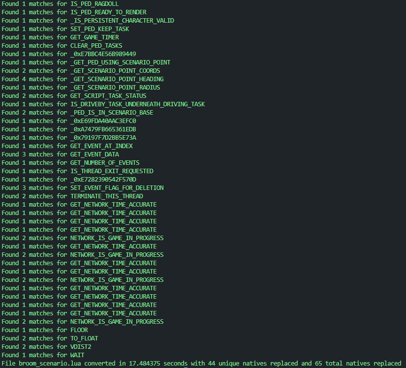

# Red Dead Redemption 2 RedM LUA Converter

1. Install Python: https://www.python.org/downloads/
2. Install Pip: https://pypi.org/project/pip/
3. Go in your terminal and write to install "requests" dependency
```
pip install requests
```
4. Place your files into the incoming/ folder
5. Start the program
```py main.py```
6. Wait... ~500 lines/16 seconds
7. Enjoy the magic in outgoin/ folder

